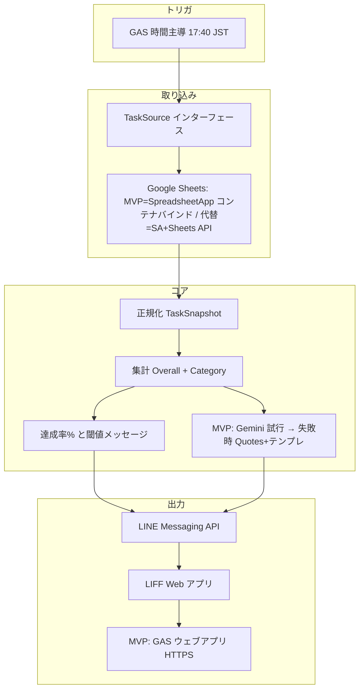

# yattakai-task-checker 設計書（SPEC）

自分で決めたタスクがその日どこまで達成できたかを、スプレッドシートをソースに集計し、**毎日 17:40（JST）** 前後に **LINE** で通知し、**LIFF** 上でダッシュボードを見られるようにするための要件・設計のたたき台。

---

## 1. ゴールとスコープ

### 1.1 今回やること（MVP 想定）

| 項目 | 内容 |
|------|------|
| トリガ | **Google Apps Script（GAS）の時間主導トリガ**で **毎日 17:40（JST）**。プロジェクトのタイムゾーンは **`Asia/Tokyo` 等で明示**する。 |
| ソース | **Google スプレッドシート**（当面）。**MVP** は **スプレッドシートにコンテナバインドした GAS** から `SpreadsheetApp` で読む（§1.3）。**サービスアカウント**は Node 等の外部バックエンド経路向けに設計上残す（§9）。 |
| 処理 | タスクを正規化し、**達成率・カテゴリ別集計**を算出。■2（名言パート）は **まず Gemini API で生成を試み**、**失敗時は `Quotes`＋テンプレートにフォールバック**する（詳細は §6）。 |
| 届け先 | **LINE Messaging API** で通知。**LIFF** でダッシュボード（■1 上段・下段、■2）を表示。 |
| 将来 | **Excel / Notion** などは **同じ「タスクソース」境界**の別実装で差し替え可能にする。 |

### 1.1.1 トリガ精度（GAS の注意点）

- GAS の時間主導トリガは、仕様上 **数分〜最大で ±15 分程度の揺らぎ**が起こりうる
- MVP は「17:40 前後に届けば良い」前提で GAS を採用する
- もし将来「17:40 ちょうど」が要件になった場合は、**GitHub Actions の cron**やクラウドスケジューラ等への移行を検討する（設計上はトリガ差し替え可能）

### 1.2 今回やらないこと（★★★ 次フェーズのメモ）

- 週次のまとめレポート
- 未達成タスクの AI 相談（根本原因・仕組み化）
- 時間指定のプッシュ通知（18:30 コンビニストップ、8:00 残像、9:00 タイピング等）
- LIFF からの **即時**シート書き戻し（設計上は拡張可能にするが実装は後）

### 1.3 MVP 実装決定事項（ヒアリング反映）

以下は実装に着手するための **確定した選択**。設計の他節と矛盾する場合は **本節を優先**し、あとで設計書全体を揃える。

| # | テーマ | 決定内容 |
|---|--------|----------|
| 1 | 実行形態 | **GAS 中心**（まず A）。時間主導トリガ・Sheets・`UrlFetchApp` で **LINE** と **■2 用 Gemini API**（**API キー未設定時は Gemini を呼ばず §6.2 のみ**） |
| 2 | スプレッドシート | **新規テンプレ**（`Categories` / `Tasks` / `Daily` / **`Quotes`（§4.4）**）。**コンテナバインド**の GAS プロジェクトを同一ブックに紐づける |
| 3 | LINE | **これから**公式アカウント・Messaging API を開設 |
| 4 | 通知 | **自動プッシュ**（17:40 前後。GAS トリガの揺らぎは §1.1.1） |
| 5 | LIFF | **MVP で必須**。プッシュ文面に LIFF URL を載せ **■1・■2** を表示 |
| 6 | LIFF のホスト | **Google Apps Script のウェブアプリ**（`doGet`） |
| 7 | 画面と API | **薄い HTML（シェル）** ＋ **別リクエストで JSON**（例: `?format=json&date=...` 等）。フロントで描画 |
| 8 | `Daily` 記号 | **◯**＝`done`、**✕ または ×**＝`not_done`、**空欄**＝未記入（`unset` 等） |
| 9 | ■2（名言・セリフ） | **Gemini 優先**。GAS から **Gemini API** を呼び、`{ quote, ichisan, hiroko, ichisan_image, hiroko_image }` 形式の JSON を得る。**失敗時**（タイムアウト、HTTP エラー、429、JSON 不正、必須キー欠落、**API キー未設定**など）は **§6.2 のテンプレ経路**へフォールバック（`Quotes`＋テンプレ）。`*_image` は §5.5.1 の表情対応表から達成率で決まるファイル名 |
| 10 | 公開 URL 対策 | ウェブアプリを **匿名アクセス可**にするため、プッシュに載せる URL に **その日だけ有効なランダム `token`** を付与し、`date` と組で GAS 側検証する |
| 11 | ■2 最終フォールバック | **LINE プッシュは送る**。Gemini もテンプレも使えない場合は、■2 を **固定の短いフォールバック文**（例: 本日の名言を表示できない）＋■1 系は表示可能なら表示 |
| 12 | ソース管理 | **`clasp`** でローカル（`yattakai-task-checker`）と双方向同期し **Git にコミット** |
| 13 | ウェブアプリデプロイ | **実行ユーザー**: スクリプト所有者。**アクセス**: **全員（匿名を含む）** → §1.3 の **トークン検証が必須** |
| 14 | 他 LLM・有料枠 | **Anthropic 等**は `AiDialogue`（§2.1）で **Gemini 実装と差し替え**可能。運用が固まったら **Gemini 有料**や **別プロバイダ**へ移行可 |

**実装時にユーザー側で準備するもの（コード外）**

- LINE: Messaging API チャネル、**チャネルアクセストークン**、プッシュ先の **ユーザー ID**（友だち追加後に取得）
- LINE Developers: **LIFF アプリ**登録、**エンドポイント URL**（GAS ウェブアプリデプロイ後の URL を設定）
- **Google Gemini API** 用の **API キー**（スクリプトプロパティ。未設定なら **Gemini をスキップして §6.2 のみ**で動く）
- **無料枠利用時**: Google の案内どおり **データがプロダクト改善に使われ得る**条件がある。**プロンプトに載せる内容**（個人タスク名の大量投入など）は最小化することを推奨

**Tailwind CSS（§5.0）と GAS の両立**

- ビルドした CSS を GAS プロジェクトに同梱するか、MVP のみ **Tailwind CDN** にするかは実装フェーズで選択（設計上どちらも許容）

---

## 2. 論理アーキテクチャ

「スプレッドシート」「LINE」「■2 台詞生成（**Gemini 優先・失敗時テンプレ**／将来は他 LLM 可）」を **ドメインモデル**で切り離す。

### 2.1 差し替えポイント（必須の設計原則）

| 境界 | 役割 | 差し替え例 |
|------|------|------------|
| **TaskSource** | 認証・接続・生データ取得 → **正規化済みスナップショット** | **MVP**: コンテナバインド `SpreadsheetApp`。**代替**: サービスアカウント + Sheets API、Excel、Notion |
| **TaskRepository（将来）** | 書き戻し・キュー投入 | バッチフラッシュ、ログ追加 |
| **QuoteRepository** | 名言マスタの取得（**MVP**: `Quotes` シート） | シート、JSON、外部 DB |
| **DialogueBuilder（MVP）** / **AiDialogue（将来）** | イチ／ヒロの台詞組み立て | **MVP**: **Gemini 優先**、失敗時 **テンプレ＋`Quotes`（§6.2）**。**将来**: Anthropic 等へ差し替え |

上位（集計・UI 用 DTO・閾値ルール）は **正規化モデルだけ**に依存させる。

### 2.2 実装上の堅牢性（DI・型・バリデーション）

入力（スプレッドシート等）は型が緩いため、**入力層で正規化とバリデーションを完結**させ、集計層のバグを防ぐ。

- **依存性注入（DI）**:
  - `TaskSource` / `QuoteRepository` / 台詞生成境界（**MVP**: `DialogueBuilder` 相当。**将来**: `AiDialogue`）は、上位ロジックに注入する（直 import で固定しない）
  - テスト時はインメモリ実装に差し替え、集計・UI の正しさを保つ
- **TypeScript の活用（推奨）**:
  - `TaskSnapshot` / `DailySummary` 等の型を厳密に定義し、境界で崩れたデータを止める
- **Zod 等のバリデーション（推奨）**:
  - `TaskSnapshot` を Zod でパースし、想定外の空欄・文字列・記号を **「unset」等へ正規化**または **エラーとして隔離**する
  - バリデーション結果（警告・エラー）はログ出力し、後でシート運用を改善できるようにする

---

## 3. ドメインモデル

### 3.1 タスク状態

| 状態 | 意味 | UI |
|------|------|-----|
| `done` | ◯ | 達成として分子に含める |
| `not_done` | ✕ | 分母のみ（非達成） |
| `unset` 等 | 空欄・△・スキップ等 | **別ステータス**。**分母に含める**。分子には含めない。**第3の色・「未記入」等**で表示 |

※ △ を「半分」として分子に入れる等は **現状スコープ外**。必要になったら `TaskStatus` を拡張する。

### 3.2 達成率（%）

- **定義**: `達成率 = round( 達成件数 / 分母件数 × 100 )`（端数ルールは実装時に固定。四捨五入推奨）
- **分母**: 当日スナップショットに含まれる **すべてのタスク行**（`done` / `not_done` / 別ステータスすべて）
- **分子**: **`done`（◯）のみ**
- 表示は **Apple Watch の睡眠スコアのように 0〜100 で直感的**に見せてよい（中身は上記のシンプルな式から開始）

### 3.3 全体メッセージ（■1 上段）

**達成率のみ**で決定（カテゴリバランスは **MVP では使わない**）。

| 達成率（%） | メッセージ |
|-------------|------------|
| 100 | 完璧！ |
| 80 以上 | いいね！ |
| 60 以上 | あとちょっと |
| 50 以上 | 半分クリア！ |
| 30 以上 | ここからここから |
| 10 以上 | まだまだこれから！ |
| 0 以上 | まずははじめの一歩 |

**適用ルール**: 上から **最初に当てはまる行**を採用（例: 100% は「完璧！」のみ）。

### 3.4 カテゴリ

- **マスタで可変**（追加・改名）。コードに3カテゴリ固定を焼かない。
- 各カテゴリに **`category_id`（安定キー）**、**表示名**、**色（HEX 等）** を持たせ、**ドーナツと下段バーで共通利用**。
- **色設計（UX 方針）**:
  - カテゴリ色は、習慣化を促す「心地よさ」と視認性のため、**彩度・明度を揃えたパレット**で管理する（例: パステル寄り、またはダークモード向けネオン寄りのどちらかに寄せる）
  - 追加カテゴリが増えても破綻しないよう、`Categories.color` は「任意 HEX」を許容しつつ、運用上は **既存パレットから選ぶ**（パレット外は例外）

### 3.5 ドーナツチャート（■1 上段）

- **各セグメント = カテゴリの「量のシェア」**（UX 方針により **案2 を採用して固定**）
  - 定義: カテゴリ `k` の **タスク数 / 全体タスク数**（「量」のシェア）
  - 狙い: 未達成があっても、その日の「全体像（何に重点がある日か）」が一目で残り、ゲーミフィケーションが薄れにくい
- **色はカテゴリマスタと一致**

---

## 4. スプレッドシート設計（正は案 B）

運用イメージは「今は 1 枚に見える入力でもよい」が、**データの正はマスタ + 日次**。

### 4.1 シート `Categories`（カテゴリマスタ）

| 列 | 例 | 説明 |
|----|-----|------|
| category_id | `health` | 安定キー |
| display_name | 健康・運動 | 表示名（改名可） |
| color | `#3388ff` | UI 用。LIFF / レポートで共通 |
| sort_order | 1 | 表示順 |
| active | TRUE | FALSE は非表示 |

### 4.2 シート `Tasks`（タスクマスタ）

| 列 | 例 | 説明 |
|----|-----|------|
| task_id | `t_20250408_001` | 安定キー（UUID や連番でも可） |
| title | 筋トレ 20分 | 正式名（シート・管理用） |
| display_short | 筋トレ | **LIFF での略称**（未設定時は title の切り詰めルール） |
| category_id | `health` | `Categories` 参照 |
| active | TRUE | 非アクティブは日次に出さない等、ルールは実装時に固定 |
| sort_order | 10 | 表示順 |

### 4.3 シート `Daily`（日次ステータス）

| 列 | 例 | 説明 |
|----|-----|------|
| date | 2025-04-08 | 日付（ローカル日付。JST） |
| task_id | `t_...` | `Tasks` 参照 |
| status | `done` / `not_done` / `unset` | シート上は ◯ / ✕ / 空や記号を **取り込み時にマッピング** |
| updated_at | （任意・将来） | バッチ書き戻し時に付与検討 |

**案 A 風の見た目**が欲しい場合: 入力用にピボット風の別シートを用意し、**GAS で `Daily` に正規化**してもよい（正は `Daily`）。

### 4.4 シート `Quotes`（名言マスタ・MVP）

■2 の **Gemini 失敗時フォールバック**および、Gemini に渡す **引用元の名言プール**として使う。**手入力で十分**ならシート推奨（編集が容易）。

| 列 | 例 | 説明 |
|----|-----|------|
| quote_id | `q_001` | 安定キー |
| text | 千里の道も一歩から | 名言本文 |
| attribution | （任意） | 出典表示用 |
| sort_order | 1 | 並び（決定選択の補助） |
| active | TRUE | FALSE は候補から除外 |

---

## 5. LIFF 画面（■1 / ■2）

> **完成イメージ（モック）**
>
> | ■1 ダッシュボード | ■2 今日の名言 |
> |---|---|
> |  |  |
>
> - `mockups/liff-dashboard.png` … ドーナツ（達成率）＋カテゴリ別バー（§5.2・§5.3）
> - `mockups/liff-quote-of-day.png` … イチさん／ヒロ子の対話レイアウト（§5.5）
>
> ※ ファイル文言（「非常に高い」等）はモック例示値。実装時は §3.3 の閾値テーブルに従う。

### 5.0 UI 実装方針（Tailwind CSS）

- UI は **Tailwind CSS** を採用する（MVP から一貫して使用）
- 目的: 画面の試作速度を上げ、モックに近い UI を短時間で反復できるようにする
- スタイルの持ち方:
  - カテゴリ色は `Categories.color`（HEX）を正とし、チャート・バッジ等に反映する
  - Tailwind のユーティリティだけで表現できない **動的色（任意 HEX）**は、`style={{ color: ... }}` / CSS 変数（例: `--cat-color`）でブリッジする
- モバイル前提（操作性）:
  - **Safe Area**（iPhone 下部バー等）を考慮し、下端固定要素・スクロール余白に安全域を確保する（`env(safe-area-inset-*)` を CSS 変数で吸収する等）
  - タップ対象は指で押しやすいサイズ（最小 44px 目安）を守る
- 継続を促すフィードバック:
  - タスク状態の切替（将来機能）では、**小さな視覚的報酬**（短いアニメーションや粒子っぽい演出）を入れられる構造にする
  - アニメーションは常時ではなく **イベント駆動**（達成時など）で控えめにする
- 推奨構成（例）:
  - LIFF/ダッシュボードは `React + Vite + Tailwind`（または同等）で静的ビルドし、`HOST` にデプロイ
  - 「GAS だけで HTML を生成する」場合も Tailwind を使いたいなら、事前ビルドした CSS（最小化済み）を同梱して配布する

### 5.1 情報設計（ファーストビューの優先順位）

17:40 に LINE を開いて「まず何を見るか」を固定し、情報の過多を避ける。

ファーストビューの順序は次で統一する（重要度順）:

1. **達成率（数字）**: 中央の 0〜100（睡眠スコアのような主指標）
2. **全体メッセージ（感情）**: 閾値テーブルによる短い一言
3. **名言（インスピレーション）**: その日の気分を持ち上げるセクション（■2）

### 5.2 ■1 上段

- **ドーナツ** + 中央 **達成率（%）** + **閾値メッセージ**（§3.3）
- ドーナツは §3.5 に従い **カテゴリ色と連動**

### 5.3 ■1 下段

- カテゴリごとに **達成 / 未達成 / 別ステータス** を区別
- **2/5 のような分数**、**バーまたはアイコン**で可視化
- **v1**: タップで ◯ に書き戻しは **未実装**でもよいが、コンポーネントは **`onTaskToggle` を差し込める**形にする
- **未達成タスクの取り扱い（将来の拡張ポイント）**:
  - 「未達成」だけは、ワンタップで **理由メモ**、または **明日に回す** を置きたくなる前提で、UI にプレースホルダーを持たせる
  - MVP ではボタンは **無効（Coming soon）** で良いが、将来の書き戻し（§8）と接続できる前提で設計する

### 5.4 プライバシー（表示ポリシー）

- **カテゴリ別の件数・進捗を主**に表示
- **タスクの全文タイトルは出しすぎない**。**折りたたみ・略称（`display_short`）** で段階的に開く

### 5.5 ■2 今日の名言（ファーストビュー優先）

- **イチさん**: 名言を読み上げる口調（**MVP**: 主に **Gemini 生成**、失敗時はテンプレ）
- **ヒロ子**: 意味の簡単な解説 + リアクション（**MVP**: 同上）
- **素材（MVP）**: **Gemini 成功時**はモデル出力を正とする。**フォールバック時**は **`Quotes` シート（§4.4）または GAS 内配列**から **決定的に 1 件**選び、テンプレに差し込む
- **トーン（MVP）**: Gemini プロンプトに **§3.3 の閾値メッセージ**・達成率等を渡す。フォールバック時はテンプレ側で同情報を使用
- **著作権・出典**: **`Quotes` はフォールバック用の安全な名言のみ**手入力。Gemini に渡す引用元は **権利・プライバシーに注意**（無料枠のデータ利用条件は公式を参照）

### 5.5.1 キャラクター表情（得点連動）

■2 のアバター画像は、**達成率に応じた表情**を選ぶ。得点によって顔が変わることで、毎日の振り返りが感情に刺さり、翌日へのモチベーションにつながる。選択ロジックは §3.3 と同じ「上から最初に当てはまる行」を採用する。

画像は `docs/mockups/characters/` に収録（ヒロ子 10 枚・イチさん 6 枚）。実装では GAS と LIFF の両方からファイル名文字列を定数として参照できる形にする。

| 達成率（%） | §3.3 メッセージ | `ichisan_image` | `hiroko_image` |
|------------|----------------|----------------|----------------|
| 100 | 完璧！ | `ichisan-happy.png` | `hiroko-happy.png` |
| 80 以上 | いいね！ | `ichisan-happy.png` | `hiroko-bashful.png` |
| 60 以上 | あとちょっと | `ichisan-normal.png` | `hiroko-normal.png` |
| 50 以上 | 半分クリア！ | `ichisan-serious.png` | `hiroko-normal.png` |
| 30 以上 | ここからここから | `ichisan-serious.png` | `hiroko-remorse.png` |
| 10 以上 | まだまだこれから！ | `ichisan-sad.png` | `hiroko-confused.png` |
| 0 以上 | まずははじめの一歩 | `ichisan-sad.png` | `hiroko-sad.png` |

**選択責務**: `DialogueBuilder`（§2.1）が達成率を受け取り、上記のテーブルを評価してファイル名を返す。Gemini 経路・テンプレ経路いずれも同じテーブルを使い、**テキストと表情は常にセットで決まる**。

**フォールバック（画像欠落時）**: `` が読み込めない場合は CSS グラデーション円形で代替し、UI が崩れないようにする。

---

## 6. ■2 の生成（日次）

### 6.1 MVP（Gemini 優先 ＋ フォールバック）

| 項目 | 方針 |
|------|------|
| 対象 | **イチさん・ヒロ子**の表示テキスト（UI・JSON で同一構造） |
| 第 1 経路 | GAS の **`UrlFetchApp`** で **Google Gemini API** を呼ぶ。**API キー**はスクリプトプロパティ（未設定なら **第 2 経路のみ**） |
| 入力 | **§3.3 メッセージ**、達成率（%）、カテゴリ別件数（必要最小限）、**`Quotes` から選んだ名言 1 件**（引用として渡す・または「この名言を口語化」と指示）など。**個人のタスク全文は載せない**方針を推奨 |
| 出力契約 | 応答を **`{ "quote", "ichisan", "hiroko", "ichisan_image", "hiroko_image" }` の JSON** として返させ、GAS で **パース＋キー検証**する。`ichisan_image` / `hiroko_image` は §5.5.1 の表情対応表から得点に応じたファイル名（例: `"ichisan-happy.png"`）を Gemini に指定させるか、**GAS 側でテーブル評価して上書き**するかを実装フェーズで決定する（後者が安全） |
| 失敗時の扱い | 次のいずれかで **第 2 経路（§6.2）**へ落とす: タイムアウト、HTTP エラー、**429**、JSON 不正、必須キー欠落、**キー未設定** |

**無料枠**: 利用条件・クォータは **公式の最新表**に従う。レート制限に達した日は **自然とテンプレに寄る**。

### 6.2 MVP（テンプレフォールバック・必須の着地）

Gemini が使えない日・失敗時も **同じ JSON 形**で返す。

| 項目 | 方針 |
|------|------|
| 名言本文 | **`Quotes` シート**（§4.4）または **GAS 内の定数配列** |
| 選択ロジック | **決定的**（同じ日・同じ入力なら同じ結果）。例: `hash(date) % len(active_quotes)` |
| セリフ生成 | **テンプレート**に `{{quote}}`・`{{achievement_percent}}`・`{{mood_message}}`（§3.3）等を差し込む。イチ／ヒロでテンプレを分ける |
| 出力 | **`{ quote, ichisan, hiroko, ichisan_image, hiroko_image }` 形式**（§6.1 と同一キー）。`*_image` は §5.5.1 の対応表から **達成率に応じて決定的に選択**する（Gemini 経路と異なり、テンプレ経路では必ずテーブル評価でファイル名を付与する） |

**バリデーション**: `Quotes` 行は **必須列・空 text** を検査。不正行はスキップしログ。有効行が 0 件なら **§1.3 #11** の最終フォールバック文。

### 6.3 将来（他 LLM・高度化・保留）

- **`AiDialogue` 実装**（§2.1）で **Gemini を Anthropic 等に差し替え**、または **マルチプロバイダ**に拡張可能にする
- プロンプトは **XML タグ**（`<reference_quote>`, `<user_achievement>`）で入力分離、**Few-shot**、**JSON 出力**を要求してもよい
- **失敗時の着地は常に §6.2**（運用の安全網を維持）

---

## 7. LINE / LIFF

- **Messaging API（公式アカウント）** でプッシュ（または同等の配信）
- 本文に **LIFF 用 URL**（例: `?date=YYYY-MM-DD`）を含める
- 後から **通常の HTTPS URL のみ**に寄せる場合: 送る文字列と **認証方式** を変える。**ダッシュボードの HTML は流用**し、**LIFF SDK への依存を最小化**しておく

---

## 8. 将来の書き戻し（設計のみ）

### 8.1 方針

- **キューに溜めてバッチ**でスプレッドシートへ反映（数分おき・1 日 1 回など）。オフライン気味でもよい
- **同日の複数回更新はほぼ想定しない** → **当面は上書きでシンプル**

### 8.2 ログを後から足しやすくする

- すべての更新を **`applyChange(taskId, date, newStatus, meta)`**（名前は任意）に集約
- **現状**: `meta` を無視して `Daily` のセルを上書き
- **将来**: 同一関数内で **`ChangeLog` シートへ append** や **監査 ID** を追加できるようにする

楽観的ロックは **MVP では不要**。必要になったら `updated_at` や版番号を `Daily` に追加

### 8.3 「理由メモ」「明日に回す」のためのイベント設計（将来）

未達成タスクに対して将来置きたくなる操作を、バッチ書き戻し設計と矛盾しない形で定義しておく。

- **`defer_to_tomorrow`**: 「明日に回す」イベント（`task_id`, `from_date`, `to_date`, `meta`）
- **`add_reason_note`**: 理由メモ追加イベント（`task_id`, `date`, `note`, `meta`）

MVP では UI プレースホルダーのみ。実装時は「イベントをキューへ積む」→「バッチで反映」の流れを踏襲する

---

## 9. 認証・接続

- **MVP（§1.3）**: **コンテナバインド GAS** ＋ **`SpreadsheetApp`**（トリガ作成者の Google アカウント権限）。**サービスアカウントは使用しない**構成が素直
- **将来 / 別実装**: **サービスアカウント**で共有スプレッドシートにアクセス（外部 Node 等）、または GAS のみ、に **TaskSource 実装を差し替え**可能にする（§2.1）

---

## 10. オープン項目・フォローアップ

**ヒアリングで確定済み（§1.3）のため、旧オープンから外したもの**

- 実行形態（GAS 中心）、LIFF ホスト（GAS ウェブアプリ）、HTML+JSON 分離、`Daily` 記号マッピング、ドーナツ定義は §3.5（案2 固定）に記載済み

**未確定・実装フェーズで詰める項目**

1. 名言の **出典・利用ポリシー** の文書化（**MVP は手入力 `Quotes` なら軽めで可**。ネット収集を始めるなら必須に近い）
2. **スケーラビリティ**: アクセス増時に **Cloudflare Workers + KV** 等でキャッシュ層を挟むか（現状は GAS ウェブアプリ一本）
3. **Gemini 以外・高度化（§6.3）**: プロバイダ差し替え、XML / few-shot、**リトライ回数（Gemini 側の軽い再試行のみ等）**、クォータ監視
4. **トークン運用詳細**: 長さ、保存場所（スクリプトプロパティ vs シート）、失効タイミング（当日 23:59 JST 等）の明文化
5. **Tailwind**: 本番ビルド同梱 vs MVP CDN（§1.3 末尾）
6. **Node 等への移行**: 運用が重くなったタイミングの判断基準（§2 の境界は維持）

---

## 11. 変更履歴

| 日付 | 内容 |
|------|------|
| 2026-04-08 | 初版（要件ヒアリング反映） |
| 2026-04-09 | §1.3 **MVP 実装決定事項**（追加ヒアリング）。§1.1 ソース行・§9・§10 を整合 |
| 2026-04-10 | **MVP から外部 AI を外す**（■2 は `Quotes`＋テンプレ）。§1.1・§1.3・§2・§4.4・§5.5・§6・§10 を整合 |
| 2026-04-11 | ■2 を **Gemini API 優先**、失敗時 **§6.2 テンプレ**へフォールバック。§1.1・§1.3・§2・§5.5・§6・§10 を整合 |
| 2026-04-10 | **§5.5.1 追加**（得点連動キャラクター表情・ヒロ子 10 枚・イチさん 6 枚）。§6.1・§6.2 の JSON 出力に `ichisan_image` / `hiroko_image` を追加。§1.3 #9 の JSON キー定義を整合。画像を `docs/mockups/characters/` に収録 |
