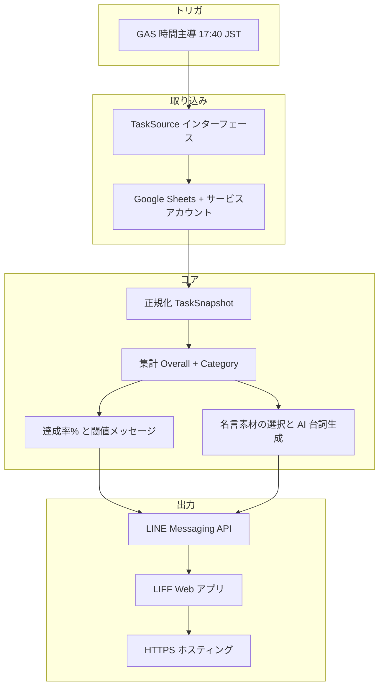

# yattakai-task-checker 設計書（SPEC）

自分で決めたタスクがその日どこまで達成できたかを、スプレッドシートをソースに集計し、**毎日 17:40（JST）** 前後に **LINE** で通知し、**LIFF** 上でダッシュボードを見られるようにするための要件・設計のたたき台。

---

## 1. ゴールとスコープ

### 1.1 今回やること（MVP 想定）

| 項目 | 内容 |
|------|------|
| トリガ | **Google Apps Script（GAS）の時間主導トリガ**で **毎日 17:40（JST）**。プロジェクトのタイムゾーンは **`Asia/Tokyo` 等で明示**する。 |
| ソース | **Google スプレッドシート**（当面）。読み取りは **サービスアカウント**で共有シートにアクセスする想定で進める。 |
| 処理 | タスクを正規化し、**達成率・カテゴリ別集計**を算出。名言パートは **AI でイチさん・ヒロ子のセリフ**を生成（詳細は §6）。 |
| 届け先 | **LINE Messaging API** で通知。**LIFF** でダッシュボード（■1 上段・下段、■2）を表示。 |
| 将来 | **Excel / Notion** などは **同じ「タスクソース」境界**の別実装で差し替え可能にする。 |

### 1.1.1 トリガ精度（GAS の注意点）

- GAS の時間主導トリガは、仕様上 **数分〜最大で ±15 分程度の揺らぎ**が起こりうる
- MVP は「17:40 前後に届けば良い」前提で GAS を採用する
- もし将来「17:40 ちょうど」が要件になった場合は、**GitHub Actions の cron**やクラウドスケジューラ等への移行を検討する（設計上はトリガ差し替え可能）

### 1.2 今回やらないこと（★★★ 次フェーズのメモ）

- 週次のまとめレポート
- 未達成タスクの AI 相談（根本原因・仕組み化）
- 時間指定のプッシュ通知（18:30 コンビニストップ、8:00 残像、9:00 タイピング等）
- LIFF からの **即時**シート書き戻し（設計上は拡張可能にするが実装は後）

---

## 2. 論理アーキテクチャ

「スプレッドシート」「LINE」「AI」を **ドメインモデル**で切り離す。

### 2.1 差し替えポイント（必須の設計原則）

| 境界 | 役割 | 差し替え例 |
|------|------|------------|
| **TaskSource** | 認証・接続・生データ取得 → **正規化済みスナップショット** | サービスアカウント → GAS の `SpreadsheetApp`、Excel、Notion |
| **TaskRepository（将来）** | 書き戻し・キュー投入 | バッチフラッシュ、ログ追加 |
| **QuoteRepository** | ネット収集・リファレンス蓄積 | シート、JSON、外部 DB |
| **AiDialogue** | イチ／ヒロのセリフ生成 | モデル・プロバイダ変更 |

上位（集計・UI 用 DTO・閾値ルール）は **正規化モデルだけ**に依存させる。

### 2.2 実装上の堅牢性（DI・型・バリデーション）

入力（スプレッドシート等）は型が緩いため、**入力層で正規化とバリデーションを完結**させ、集計層のバグを防ぐ。

- **依存性注入（DI）**:
  - `TaskSource` / `QuoteRepository` / `AiDialogue` は、上位ロジックに注入する（直 import で固定しない）
  - テスト時はインメモリ実装に差し替え、集計・UI の正しさを保つ
- **TypeScript の活用（推奨）**:
  - `TaskSnapshot` / `DailySummary` 等の型を厳密に定義し、境界で崩れたデータを止める
- **Zod 等のバリデーション（推奨）**:
  - `TaskSnapshot` を Zod でパースし、想定外の空欄・文字列・記号を **「unset」等へ正規化**または **エラーとして隔離**する
  - バリデーション結果（警告・エラー）はログ出力し、後でシート運用を改善できるようにする

---

## 3. ドメインモデル

### 3.1 タスク状態

| 状態 | 意味 | UI |
|------|------|-----|
| `done` | ◯ | 達成として分子に含める |
| `not_done` | ✕ | 分母のみ（非達成） |
| `unset` 等 | 空欄・△・スキップ等 | **別ステータス**。**分母に含める**。分子には含めない。**第3の色・「未記入」等**で表示 |

※ △ を「半分」として分子に入れる等は **現状スコープ外**。必要になったら `TaskStatus` を拡張する。

### 3.2 達成率（%）

- **定義**: `達成率 = round( 達成件数 / 分母件数 × 100 )`（端数ルールは実装時に固定。四捨五入推奨）
- **分母**: 当日スナップショットに含まれる **すべてのタスク行**（`done` / `not_done` / 別ステータスすべて）
- **分子**: **`done`（◯）のみ**
- 表示は **Apple Watch の睡眠スコアのように 0〜100 で直感的**に見せてよい（中身は上記のシンプルな式から開始）

### 3.3 全体メッセージ（■1 上段）

**達成率のみ**で決定（カテゴリバランスは **MVP では使わない**）。

| 達成率（%） | メッセージ |
|-------------|------------|
| 100 | 完璧！ |
| 80 以上 | いいね！ |
| 60 以上 | あとちょっと |
| 50 以上 | 半分クリア！ |
| 30 以上 | ここからここから |
| 10 以上 | まだまだこれから！ |
| 0 以上 | まずははじめの一歩 |

**適用ルール**: 上から **最初に当てはまる行**を採用（例: 100% は「完璧！」のみ）。

### 3.4 カテゴリ

- **マスタで可変**（追加・改名）。コードに3カテゴリ固定を焼かない。
- 各カテゴリに **`category_id`（安定キー）**、**表示名**、**色（HEX 等）** を持たせ、**ドーナツと下段バーで共通利用**。
- **色設計（UX 方針）**:
  - カテゴリ色は、習慣化を促す「心地よさ」と視認性のため、**彩度・明度を揃えたパレット**で管理する（例: パステル寄り、またはダークモード向けネオン寄りのどちらかに寄せる）
  - 追加カテゴリが増えても破綻しないよう、`Categories.color` は「任意 HEX」を許容しつつ、運用上は **既存パレットから選ぶ**（パレット外は例外）

### 3.5 ドーナツチャート（■1 上段）

- **各セグメント = カテゴリの「量のシェア」**（UX 方針により **案2 を採用して固定**）
  - 定義: カテゴリ `k` の **タスク数 / 全体タスク数**（「量」のシェア）
  - 狙い: 未達成があっても、その日の「全体像（何に重点がある日か）」が一目で残り、ゲーミフィケーションが薄れにくい
- **色はカテゴリマスタと一致**

---

## 4. スプレッドシート設計（正は案 B）

運用イメージは「今は 1 枚に見える入力でもよい」が、**データの正はマスタ + 日次**。

### 4.1 シート `Categories`（カテゴリマスタ）

| 列 | 例 | 説明 |
|----|-----|------|
| category_id | `health` | 安定キー |
| display_name | 健康・運動 | 表示名（改名可） |
| color | `#3388ff` | UI 用。LIFF / レポートで共通 |
| sort_order | 1 | 表示順 |
| active | TRUE | FALSE は非表示 |

### 4.2 シート `Tasks`（タスクマスタ）

| 列 | 例 | 説明 |
|----|-----|------|
| task_id | `t_20250408_001` | 安定キー（UUID や連番でも可） |
| title | 筋トレ 20分 | 正式名（シート・管理用） |
| display_short | 筋トレ | **LIFF での略称**（未設定時は title の切り詰めルール） |
| category_id | `health` | `Categories` 参照 |
| active | TRUE | 非アクティブは日次に出さない等、ルールは実装時に固定 |
| sort_order | 10 | 表示順 |

### 4.3 シート `Daily`（日次ステータス）

| 列 | 例 | 説明 |
|----|-----|------|
| date | 2025-04-08 | 日付（ローカル日付。JST） |
| task_id | `t_...` | `Tasks` 参照 |
| status | `done` / `not_done` / `unset` | シート上は ◯ / ✕ / 空や記号を **取り込み時にマッピング** |
| updated_at | （任意・将来） | バッチ書き戻し時に付与検討 |

**案 A 風の見た目**が欲しい場合: 入力用にピボット風の別シートを用意し、**GAS で `Daily` に正規化**してもよい（正は `Daily`）。

---

## 5. LIFF 画面（■1 / ■2）

### 5.0 UI 実装方針（Tailwind CSS）

- UI は **Tailwind CSS** を採用する（MVP から一貫して使用）
- 目的: 画面の試作速度を上げ、モックに近い UI を短時間で反復できるようにする
- スタイルの持ち方:
  - カテゴリ色は `Categories.color`（HEX）を正とし、チャート・バッジ等に反映する
  - Tailwind のユーティリティだけで表現できない **動的色（任意 HEX）**は、`style={{ color: ... }}` / CSS 変数（例: `--cat-color`）でブリッジする
- モバイル前提（操作性）:
  - **Safe Area**（iPhone 下部バー等）を考慮し、下端固定要素・スクロール余白に安全域を確保する（`env(safe-area-inset-*)` を CSS 変数で吸収する等）
  - タップ対象は指で押しやすいサイズ（最小 44px 目安）を守る
- 継続を促すフィードバック:
  - タスク状態の切替（将来機能）では、**小さな視覚的報酬**（短いアニメーションや粒子っぽい演出）を入れられる構造にする
  - アニメーションは常時ではなく **イベント駆動**（達成時など）で控えめにする
- 推奨構成（例）:
  - LIFF/ダッシュボードは `React + Vite + Tailwind`（または同等）で静的ビルドし、`HOST` にデプロイ
  - 「GAS だけで HTML を生成する」場合も Tailwind を使いたいなら、事前ビルドした CSS（最小化済み）を同梱して配布する

### 5.1 情報設計（ファーストビューの優先順位）

17:40 に LINE を開いて「まず何を見るか」を固定し、情報の過多を避ける。

ファーストビューの順序は次で統一する（重要度順）:

1. **達成率（数字）**: 中央の 0〜100（睡眠スコアのような主指標）
2. **全体メッセージ（感情）**: 閾値テーブルによる短い一言
3. **名言（インスピレーション）**: その日の気分を持ち上げるセクション（■2）

### 5.2 ■1 上段

- **ドーナツ** + 中央 **達成率（%）** + **閾値メッセージ**（§3.3）
- ドーナツは §3.5 に従い **カテゴリ色と連動**

### 5.3 ■1 下段

- カテゴリごとに **達成 / 未達成 / 別ステータス** を区別
- **2/5 のような分数**、**バーまたはアイコン**で可視化
- **v1**: タップで ◯ に書き戻しは **未実装**でもよいが、コンポーネントは **`onTaskToggle` を差し込める**形にする
- **未達成タスクの取り扱い（将来の拡張ポイント）**:
  - 「未達成」だけは、ワンタップで **理由メモ**、または **明日に回す** を置きたくなる前提で、UI にプレースホルダーを持たせる
  - MVP ではボタンは **無効（Coming soon）** で良いが、将来の書き戻し（§8）と接続できる前提で設計する

### 5.4 プライバシー（表示ポリシー）

- **カテゴリ別の件数・進捗を主**に表示
- **タスクの全文タイトルは出しすぎない**。**折りたたみ・略称（`display_short`）** で段階的に開く

### 5.5 ■2 今日の名言（ファーストビュー優先）

- **イチさん**: 名言を読み上げる口調
- **ヒロ子**: 意味の簡単な解説 + リアクション
- **素材**: ネットから収集し **リファレンスに蓄積**。その日のセリフで使う素材は **「ネット由来」と「リファレンス由来」を AI に選ばせる**（ランダム相当）
- **トーン**: **その日の達成率に応じた励まし**をプロンプトで指定
- **著作権・出典**: 運用ルールを別途決める（出典表示、引用の範囲、パブリックドメイン優先など）。実装前に `docs/` に一行ポリシーを置くことを推奨

---

## 6. AI の役割（日次）

| 項目 | 方針 |
|------|------|
| 対象 | **イチさん・ヒロ子の両方**のセリフ |
| 名言本文 | 原則 **リスト／リファレンス／当日取得分**から。**毎回ゼロから作文しない** |
| 選択 | **ネット経由の候補**と **リファレンス**のどちらを使うか **AI に選択させる** |
| 文脈 | **達成率（%）** を入力に含め、励ましの強さを調整 |

### 6.1 プロンプト設計（Claude 想定の堅牢化）

ハルシネーションを抑え、キャラクターを安定させるため、プロンプトは構造化する。

- **XML タグで入力を分離**（例）:
  - `<reference_quote>`: 名言本文 + 出典（あれば） + 収集元（ネット/リファレンス）
  - `<user_achievement>`: 達成率（%）や、カテゴリ別の概況（件数のみ等）
- **Few-shot（3例程度）**:
  - イチさん／ヒロ子の「口調・テンポ・語彙」を固定するため、過去の会話例を system 相当のコンテキストに含める
  - 例は短く、守るべき文体・禁止事項（過剰に説教しない、など）を明示する
- **出力形式の固定**:
  - 例: `{"quote": "...", "ichisan": "...", "hiroko": "..."}` のように JSON で返させ、後段で表示崩れを起こしにくくする（MVP でも有効）

---

## 7. LINE / LIFF

- **Messaging API（公式アカウント）** でプッシュ（または同等の配信）
- 本文に **LIFF 用 URL**（例: `?date=YYYY-MM-DD`）を含める
- 後から **通常の HTTPS URL のみ**に寄せる場合: 送る文字列と **認証方式** を変える。**ダッシュボードの HTML は流用**し、**LIFF SDK への依存を最小化**しておく

---

## 8. 将来の書き戻し（設計のみ）

### 8.1 方針

- **キューに溜めてバッチ**でスプレッドシートへ反映（数分おき・1 日 1 回など）。オフライン気味でもよい
- **同日の複数回更新はほぼ想定しない** → **当面は上書きでシンプル**

### 8.2 ログを後から足しやすくする

- すべての更新を **`applyChange(taskId, date, newStatus, meta)`**（名前は任意）に集約
- **現状**: `meta` を無視して `Daily` のセルを上書き
- **将来**: 同一関数内で **`ChangeLog` シートへ append** や **監査 ID** を追加できるようにする

楽観的ロックは **MVP では不要**。必要になったら `updated_at` や版番号を `Daily` に追加

### 8.3 「理由メモ」「明日に回す」のためのイベント設計（将来）

未達成タスクに対して将来置きたくなる操作を、バッチ書き戻し設計と矛盾しない形で定義しておく。

- **`defer_to_tomorrow`**: 「明日に回す」イベント（`task_id`, `from_date`, `to_date`, `meta`）
- **`add_reason_note`**: 理由メモ追加イベント（`task_id`, `date`, `note`, `meta`）

MVP では UI プレースホルダーのみ。実装時は「イベントをキューへ積む」→「バッチで反映」の流れを踏襲する

---

## 9. 認証・接続

- **現状**: **サービスアカウント**でスプレッドシートにアクセス
- **将来**: GAS の `SpreadsheetApp` や別クラウドに変えても、**TaskSource 実装の差し替え**で済むようにする

---

## 10. オープン項目（実装時に確定）

1. GAS 内で完結するか、**Node 等の小さな API** を挟んで LINE / AI を呼ぶか
2. LIFF のホスティング先（GitHub Pages、Cloudflare Pages 等）
3. ドーナツのシェア定義（§3.5 案1 vs 案2）の確定
4. 名言の **出典・利用ポリシー** の文書化
5. `unset` をシート上でどの記号・空欄で表すか（取り込みマッピング表）
6. **スケーラビリティ方針**: LIFF のバックエンドを `GAS doGet` で賄うか、**Cloudflare Workers + KV（キャッシュ）**等でスプレッドシート直接アクセスを減らすか
7. **AI オーケストレーション**: プロンプト（XML + few-shot）・出力 JSON のスキーマ・リトライ方針をどこまで MVP で固めるか

---

## 11. 変更履歴

| 日付 | 内容 |
|------|------|
| 2026-04-08 | 初版（要件ヒアリング反映） |
