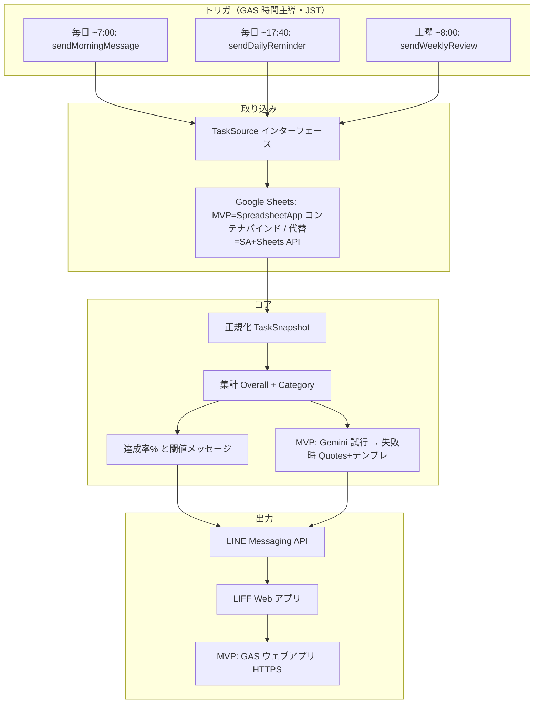
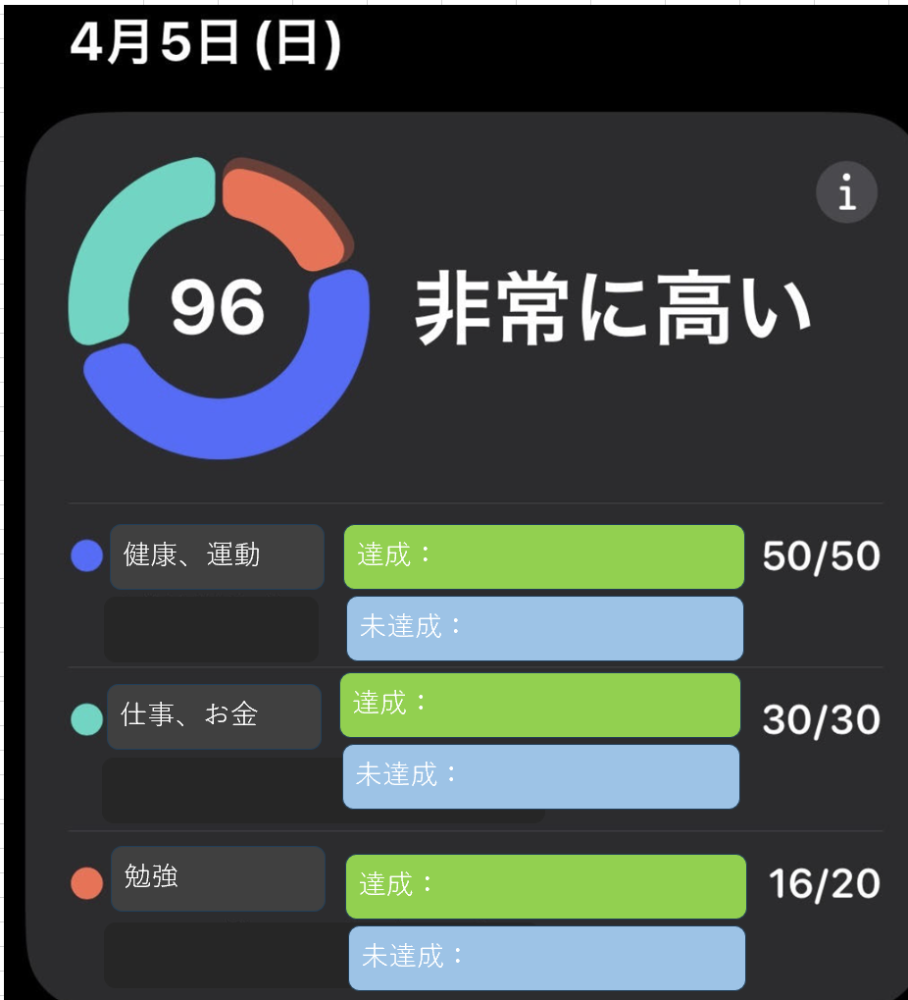
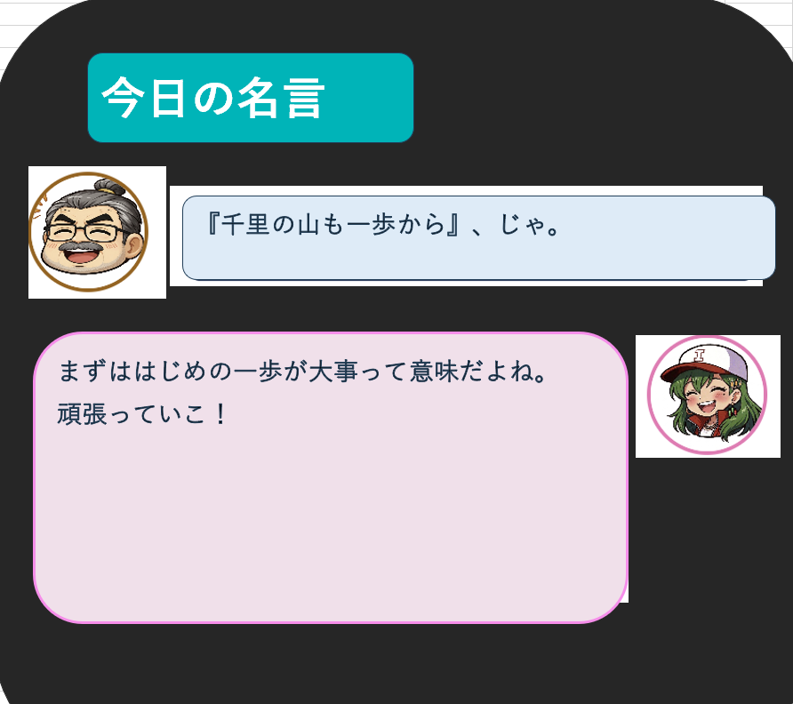

# yattakai-task-checker 設計書（SPEC）

自分で決めたタスクがその日どこまで達成できたかを、スプレッドシートをソースに集計し、**毎朝 7:00（JST）前後を目標**に軽い **LINE**（`sendMorningMessage`）と、**毎日 17:40（JST）** 前後の日次 **LINE** で通知し、**LIFF** 上でダッシュボードを見られるようにするための要件・設計のたたき台。

---

## 1. ゴールとスコープ

### 1.1 今回やること（MVP 想定）

| 項目 | 内容 |
|------|------|
| トリガ | **Google Apps Script（GAS）の時間主導トリガ**: **毎日 7:00（JST）前後**を目標に朝の軽量プッシュ（`sendMorningMessage`）、**毎日 17:40（JST）前後**に日次集計プッシュ、**毎週土曜 8:00〜8:59（JST）前後**に週次（§1.4）。TZ は **`Asia/Tokyo` 等で明示**する。 |
| ソース | **Google スプレッドシート**（当面）。**MVP** は **スプレッドシートにコンテナバインドした GAS** から `SpreadsheetApp` で読む（§1.3）。**サービスアカウント**は Node 等の外部バックエンド経路向けに設計上残す（§9）。 |
| 処理 | タスクを正規化し、**達成率・カテゴリ別集計**を算出。■2（名言パート）は **まず Gemini API で生成を試み**、**失敗時は `Quotes`＋テンプレートにフォールバック**する（詳細は §6）。 |
| 届け先 | **LINE Messaging API** で通知。**LIFF** でダッシュボード（■1 上段・下段、■2）を表示。 |
| 週次 | **GAS の時間主導トリガ**で **毎週土曜 8:00〜8:59（JST）前後**にスプレッドシートから先週 **月〜金（5営業日）** を集計し、**LINE + LIFF** で届ける（§1.4・§3.6・§5.7）。 |
| 将来 | **Excel / Notion** などは **同じ「タスクソース」境界**の別実装で差し替え可能にする。 |

### 1.1.1 トリガ精度（GAS の注意点）

- GAS の時間主導トリガは、仕様上 **数分〜最大で ±15 分程度の揺らぎ**が起こりうる（さらにキュー次第で **1 時間程度遅れる**ことも報告される）
- MVP は「17:40 前後に届けば良い」前提で GAS を採用する
- **朝の時刻をコード定数で変えた場合、`installMorningMessageTrigger` を GAS エディタから再実行しない限り、Google 側のトリガ時刻は更新されない**（`clasp push` のみでは反映されない）
- もし将来「17:40 ちょうど」が要件になった場合は、**GitHub Actions の cron**やクラウドスケジューラ等への移行を検討する（設計上はトリガ差し替え可能）

### 1.2 今回やらないこと（★★★ 次フェーズのメモ）

- ~~週次のまとめレポート~~　← **Phase 2 にてスコープイン**（§1.4・§3.6・§5.7 を参照）
- 未達成タスクの AI 相談（根本原因・仕組み化）
- 時間指定のプッシュ通知（18:30 コンビニストップ、8:00 残像、9:00 タイピング等）
- LIFF からの **即時**シート書き戻し（設計上は拡張可能にするが実装は後）

### 1.3 MVP 実装決定事項（ヒアリング反映）

以下は実装に着手するための **確定した選択**。設計の他節と矛盾する場合は **本節を優先**し、あとで設計書全体を揃える。

| # | テーマ | 決定内容 |
|---|--------|----------|
| 1 | 実行形態 | **GAS 中心**（まず A）。時間主導トリガ・Sheets・`UrlFetchApp` で **LINE** と **■2 用 Gemini API**（**API キー未設定時は Gemini を呼ばず §6.2 のみ**） |
| 2 | スプレッドシート | **新規テンプレ**（`Categories` / `Tasks` / `Daily` / **`Quotes`（§4.4）**）。**コンテナバインド**の GAS プロジェクトを同一ブックに紐づける |
| 3 | LINE | **これから**公式アカウント・Messaging API を開設 |
| 4 | 通知 | **自動プッシュ**（17:40 前後。GAS トリガの揺らぎは §1.1.1） |
| 5 | LIFF | **MVP で必須**。プッシュ文面に LIFF URL を載せ **■1・■2** を表示 |
| 6 | LIFF のホスト | **Google Apps Script のウェブアプリ**（`doGet`） |
| 7 | 画面と API | **薄い HTML（シェル）** ＋ **別リクエストで JSON**（例: `?format=json&date=...` 等）。フロントで描画 |
| 8 | `Daily` 記号 | **◯**＝`done`、**✕ または ×**＝`not_done`、**空欄**＝未記入（`unset` 等） |
| 9 | ■2（名言・セリフ） | **Gemini 優先**。GAS から **Gemini API** を呼び、公開 JSON では **`quote` / `quote_attribution` / `quote_meaning`（§4.4 `meaning` 列・シート正本）/ `ichisan` / `hiroko` / `ichisan_image` / `hiroko_image`** を返す。Gemini の応答 JSON は **`quote` / `ichisan` / `hiroko`** のみでよいが、**`quote_meaning` は常にシート由来**で GAS が付与する。**失敗時**（タイムアウト、HTTP エラー、429、JSON 不正、必須キー欠落、**API キー未設定**など）は **§6.2 のテンプレ経路**へフォールバック（`Quotes`＋テンプレ）。`*_image` は §5.5.1 の表情対応表から達成率で決まるファイル名 |
| 10 | 公開 URL 対策 | ウェブアプリを **匿名アクセス可**にするため、プッシュに載せる URL に **その日だけ有効なランダム `token`** を付与し、`date` と組で GAS 側検証する |
| 11 | ■2 最終フォールバック | **LINE プッシュは送る**。Gemini もテンプレも使えない場合は、■2 を **固定の短いフォールバック文**（例: 本日の名言を表示できない）＋■1 系は表示可能なら表示 |
| 12 | ソース管理 | **`clasp`** でローカル（`yattakai-task-checker`）と双方向同期し **Git にコミット** |
| 13 | ウェブアプリデプロイ | **実行ユーザー**: スクリプト所有者。**アクセス**: **全員（匿名を含む）** → §1.3 の **トークン検証が必須** |
| 14 | 他 LLM・有料枠 | **Anthropic 等**は `AiDialogue`（§2.1）で **Gemini 実装と差し替え**可能。運用が固まったら **Gemini 有料**や **別プロバイダ**へ移行可 |
| 15 | 朝のプッシュ | **毎日 7:00（JST）前後**を目標に `sendMorningMessage`（テンプレのみ・Gemini なし）。`installMorningMessageTrigger` が `MORNING_PUSH_HOUR_JST_` 等を読み登録する。揺らぎ・遅延は §1.1.1。**土曜**は §1.4 W-2 の週次（8 時台）と **近い午前**に届くことがあるが、べき等キーは `morning:` と `sent_week:` で分離され **両方届きうる** |

#### 1.3.1 LINE 本文への内部状態出力禁止

LINE プッシュ本文に含めてはならない情報:

- 経路識別子（例: 「（Gemini）」「（テンプレ）」等）
- 内部エラーメッセージ・スタックトレース
- GAS プロジェクト ID・スプレッドシート ID
- token の生値（URL の一部として含める場合は除く）

経路識別子はデバッグ用として `Logger.log` のみに出力する。本番と開発の分岐は `DEBUG` フラグ（スクリプトプロパティ）等で管理する。

**実装時にユーザー側で準備するもの（コード外）**

- LINE: Messaging API チャネル、**チャネルアクセストークン**、プッシュ先の **ユーザー ID**（友だち追加後に取得）
- LINE Developers: **LIFF アプリ**登録、**エンドポイント URL**（GAS ウェブアプリデプロイ後の URL を設定）
- **Google Gemini API** 用の **API キー**（スクリプトプロパティ。未設定なら **Gemini をスキップして §6.2 のみ**で動く）
- **無料枠利用時**: Google の案内どおり **データがプロダクト改善に使われ得る**条件がある。**プロンプトに載せる内容**（個人タスク名の大量投入など）は最小化することを推奨

**Tailwind CSS（§5.0）と GAS の両立**

- ビルドした CSS を GAS プロジェクトに同梱するか、MVP のみ **Tailwind CDN** にするかは実装フェーズで選択（設計上どちらも許容）

---

### 1.4 週次振り返り機能 実装決定事項（Phase 2）

「先週月〜金の振り返りを土曜朝に配信する」機能の確定選択。日次（§1.3）と矛盾する場合は本節を優先する。

| # | テーマ | 決定内容 |
|---|--------|----------|
| W-1 | 集計対象 | **月〜金（5営業日）**。土曜朝の配信時点で「先週月〜金」を集計する。当日（土曜）分は含めない |
| W-2 | 配信時刻 | **土曜 8 時台（8:00〜8:59 JST）**。GAS `atHour(8)` による 1 時間幅。揺らぎは §1.1.1 と同様に許容する。**§1.3 #15** の朝プッシュは **平日とも目標 7 時台**のため、土曜は **朝（7 時台目標）と週次（8 時台）の 2 プッシュ**が近い午前に届くことがある |
| W-3 | 達成率の定義 | **日次平均**（月〜金各日の達成率を算術平均）。未記入日は **0% として分母に含む**（§3.6） |
| W-4 | LINE 本文 | **シンプル**：週次達成率（%）と LIFF URL のみ。内部情報・キャラクターセリフは含めない |
| W-5 | 週次 LIFF UI | **カテゴリ別色分け積み上げ横棒グラフ**（Y 軸 = 曜日、X 軸 = 達成率）。曜日ごとの比較が主目的。キャラクター（■2 相当）は**なし**（§5.7） |
| W-6 | データ不足時 | **配信する**。集計対象が 5 日未満の場合（ローンチ直後等）は LIFF 内に「今週は○日分のデータで集計しています」と明示（§5.7） |
| W-7 | べき等キー | `sent_week:{weekStartJst}`（その週の月曜の JST 日付。例: `sent_week:2026-04-13`）。日次の `sent:` プレフィックスとは分離 |
| W-8 | LIFF エンドポイント | **日次と同一の `doGet`**。週次は **`?oid=<32hex>`（不透明 ID・サーバー正本）** を主経路とし、従来の `?weekStart=YYYY-MM-DD&token=xxx&yw=1` は後方互換（§5.7.3）。`parseWebAppQuery_` で URL 直下と `liff.state` をマージし、週次トークンエラーは `weeklyTokenErrorHtmlHint_` を用いる。HTML は LIFF 内表示向けに `XFrameOptionsMode.ALLOWALL` を付与する |
| W-9 | 閾値メッセージ | **§3.3.2 の閾値テーブルを流用**。週平均達成率を同じ帯に通す |

#### 1.4.1 `sent_week` のコミットと週次の再実行

週次 `sendWeeklyReview` は汎用 `withLock_` を使わず、**ScriptLock 下で `sendWeeklyReviewImpl_` が true を返したときのみ** `sent_week:{weekStartJst}` を書く（W-7）。`true` は週次専用の LINE 送信が **HTTP 200 で確定**した場合に限る。送れなかった場合はフラグが立たないため、**同一 `weekStartJst` のあいだに GAS で `sendWeeklyReview` を手動再実行**すれば再送できる。429 / 5xx は週次経路のみ短い待ちのあと数回まで再試行する。運用手順・ログの読み方は `docs/WEEKLY_LINE_TROUBLESHOOTING.md` を参照。

日次の `sent:` / 朝の `morning:` は従来どおり `withLock_` と `linePushText_` のみ（変更しない）。

---

## 2. 論理アーキテクチャ

「スプレッドシート」「LINE」「■2 台詞生成（**Gemini 優先・失敗時テンプレ**／将来は他 LLM 可）」を **ドメインモデル**で切り離す。



### 2.1 差し替えポイント（必須の設計原則）

| 境界 | 役割 | 差し替え例 |
|------|------|------------|
| **TaskSource** | 認証・接続・生データ取得 → **正規化済みスナップショット** | **MVP**: コンテナバインド `SpreadsheetApp`。**代替**: サービスアカウント + Sheets API、Excel、Notion |
| **TaskRepository（将来）** | 書き戻し・キュー投入 | バッチフラッシュ、ログ追加 |
| **QuoteRepository** | 名言マスタの取得（**MVP**: `Quotes` シート） | シート、JSON、外部 DB |
| **DialogueBuilder（MVP）** / **AiDialogue（将来）** | イチ／ヒロの台詞組み立て | **MVP**: **Gemini 優先**、失敗時 **テンプレ＋`Quotes`（§6.2）**。**将来**: Anthropic 等へ差し替え |

上位（集計・UI 用 DTO・閾値ルール）は **正規化モデルだけ**に依存させる。

### 2.2 実装上の堅牢性（DI・型・バリデーション）

入力（スプレッドシート等）は型が緩いため、**入力層で正規化とバリデーションを完結**させ、集計層のバグを防ぐ。

- **依存性注入（DI）**:
  - `TaskSource` / `QuoteRepository` / 台詞生成境界（**MVP**: `DialogueBuilder` 相当。**将来**: `AiDialogue`）は、上位ロジックに注入する（直 import で固定しない）
  - テスト時はインメモリ実装に差し替え、集計・UI の正しさを保つ
- **TypeScript の活用（推奨）**:
  - `TaskSnapshot` / `DailySummary` 等の型を厳密に定義し、境界で崩れたデータを止める
- **Zod 等のバリデーション（推奨）**:
  - `TaskSnapshot` を Zod でパースし、想定外の空欄・文字列・記号を **「unset」等へ正規化**または **エラーとして隔離**する
  - バリデーション結果（警告・エラー）はログ出力し、後でシート運用を改善できるようにする

---

## 3. ドメインモデル

### 3.1 タスク状態

| 状態 | 意味 | UI |
|------|------|-----|
| `done` | ◯ | 達成として分子に含める |
| `not_done` | ✕ | 分母のみ（非達成） |
| `unset` 等 | 空欄・△・スキップ等 | **別ステータス**。**分母に含める**。分子には含めない。**第3の色・「未記入」等**で表示 |

※ △ を「半分」として分子に入れる等は **現状スコープ外**。必要になったら `TaskStatus` を拡張する。

### 3.2 達成率（%）

- **定義**: `達成率 = round( 達成件数 / 分母件数 × 100 )`（端数ルールは実装時に固定。四捨五入推奨）
- **分母**: 当日スナップショットに含まれる **すべてのタスク行**（`done` / `not_done` / 別ステータスすべて）
- **分子**: **`done`（◯）のみ**
- 表示は **Apple Watch の睡眠スコアのように 0〜100 で直感的**に見せてよい（中身は上記のシンプルな式から開始）

### 3.3 全体メッセージ（■1 上段）

**達成率のみ**で決定（カテゴリバランスは **MVP では使わない**）。

#### 3.3.1 unset 全占有ケース（優先判定）

当日スナップショットで `done = 0` かつ `not_done = 0` かつ `unset > 0` の場合（全タスク未記入）、以下のテーブルより**先に**次を返す。

| 条件 | メッセージ |
|------|-----------|
| `done=0, not_done=0, unset>0` | まだ記入されていません |

このケースはトリガ実行（17:40）時点でシートに一度も ◯/✕ が記入されていない状態を想定する。達成率 0% の「フォロー」トーンとは文脈が異なるため、閾値テーブルとは切り離して処理する。

#### 3.3.2 閾値テーブル（§3.3.1 が適用されない場合）

| 達成率（%） | メッセージ |
|-------------|------------|
| 100 | 完璧！ |
| 80 以上 | いいね！ |
| 60 以上 | あとちょっと |
| 50 以上 | 半分クリア！ |
| 30 以上 | ここからここから |
| 10 以上 | まだまだこれから！ |
| 0 以上 | まずははじめの一歩 |

**適用ルール**: 上から **最初に当てはまる行**を採用（例: 100% は「完璧！」のみ）。

### 3.4 カテゴリ

- **マスタで可変**（追加・改名）。コードに3カテゴリ固定を焼かない。
- 各カテゴリに **`category_id`（安定キー）**、**表示名**、**色（HEX 等）** を持たせ、**ドーナツと下段バーで共通利用**。
- **色設計（UX 方針）**:
  - カテゴリ色は、習慣化を促す「心地よさ」と視認性のため、**彩度・明度を揃えたパレット**で管理する（例: パステル寄り、またはダークモード向けネオン寄りのどちらかに寄せる）
  - 追加カテゴリが増えても破綻しないよう、`Categories.color` は「任意 HEX」を許容しつつ、運用上は **既存パレットから選ぶ**（パレット外は例外）

### 3.5 ドーナツチャート（■1 上段）

- **各セグメント = カテゴリの「量のシェア」**（UX 方針により **案2 を採用して固定**）
  - 定義: カテゴリ `k` の **タスク数 / 全体タスク数**（「量」のシェア）
  - 狙い: 未達成があっても、その日の「全体像（何に重点がある日か）」が一目で残り、ゲーミフィケーションが薄れにくい
- **色はカテゴリマスタと一致**
- **SVG 実装方針**（`mkDonut` 関数）
  - Layer-1: グレー背景トラック（`<circle stroke="#E2E8F0">`）を **常時** 表示する。タスクが 0 件のときでも円の輪郭が見える。
  - Layer-2: 各カテゴリを **`<path fill=色>`** のドーナツスライスとして直接描画（`stroke-dasharray` 不使用）。
  - **`stroke-dasharray` による分割は廃止**。重なった dashed-circle が生むアンチエイリアシング seam（グレー漏れ）を根絶するため、**SVG `<path>` Arc コマンド**で各セグメントの形状を直接計算する。
  - セグメント角度は度数法（0–360°）で管理。最終セグメントは `360 − Σ前セグメント角` で累積誤差を吸収し **完全閉環** を保証する。
  - `cat.total = 0` のカテゴリはセグメント描画から除外（ゼロ長パスの SVG アーティファクト防止）。
  - 360° 単一セグメントのみ degenerate arc 回避のため `<circle stroke=色>` にフォールバック。

### 3.6 週次達成率

週次振り返り（§1.4）で使う達成率の定義。

- **集計対象**: 月〜金（5営業日）
- **計算式**: `週次達成率 = round( Σ(各曜日の日次達成率) / 5 )`
- **未記入日（unset 全占有）**: 達成率 **0%** として計算に含める（W-3）
- **Daily 行が存在しない日**: 0% として扱う（ensureDailyRows の有無に関わらず同様）
- **週次メッセージ**: §3.3.2 の閾値テーブルを流用する（W-9）

#### 3.6.1 週次 unset 全占有ケース（優先判定）

月〜金の全日について Daily 行が 1 件も存在しない場合は、閾値テーブルより先に次を返す。

| 条件 | メッセージ |
|------|-----------|
| 週内に有効データが 1 件もない | 今週はまだデータがありません |

#### 3.6.2 日別比較（曜日ごとの内訳）

週次 LIFF では週平均達成率に加え、**曜日ごとの日次達成率**と**カテゴリ別内訳**を表示する（§5.7）。
どの曜日・カテゴリが低かったかを一目で確認できることが週次レポートの主目的である。

---

## 4. スプレッドシート設計（正は案 B）

運用イメージは「今は 1 枚に見える入力でもよい」が、**データの正はマスタ + 日次**。

### 4.1 シート `Categories`（カテゴリマスタ）

| 列 | 例 | 説明 |
|----|-----|------|
| category_id | `health` | 安定キー |
| display_name | 健康・運動 | 表示名（改名可） |
| color | `#3388ff` | UI 用。LIFF / レポートで共通 |
| sort_order | 1 | 表示順 |
| active | TRUE | FALSE は非表示 |

### 4.2 シート `Tasks`（タスクマスタ）

| 列 | 例 | 説明 |
|----|-----|------|
| task_id | `t_20250408_001` | 安定キー（UUID や連番でも可） |
| title | 筋トレ 20分 | 正式名（シート・管理用） |
| display_short | 筋トレ | **LIFF での略称**（未設定時は title の切り詰めルール） |
| category_id | `health` | `Categories` 参照 |
| active | TRUE | 非アクティブは日次に出さない等、ルールは実装時に固定 |
| sort_order | 10 | 表示順 |

### 4.3 シート `Daily`（日次ステータス）

| 列 | 例 | 説明 |
|----|-----|------|
| date | 2025-04-08 | 日付（ローカル日付。JST） |
| task_id | `t_...` | `Tasks` 参照 |
| status | `done` / `not_done` / `unset` | シート上は ◯ / ✕ / 空や記号を **取り込み時にマッピング** |
| updated_at | （任意・将来） | バッチ書き戻し時に付与検討 |

**案 A 風の見た目**が欲しい場合: 入力用にピボット風の別シートを用意し、**GAS で `Daily` に正規化**してもよい（正は `Daily`）。

### 4.4 シート `Quotes`（名言マスタ・MVP）

■2 の **Gemini 失敗時フォールバック**および、Gemini に渡す **引用元の名言プール**として使う。**手入力で十分**ならシート推奨（編集が容易）。`seed/quotes.csv` をインポートする場合は **同じ列名**を推奨する（`seed/IMPORT.txt` 参照）。

| 列 | 例 | 説明 |
|----|-----|------|
| quote_id | `q_001` | 安定キー（運用・差分の目印。日次選択の主キーではない） |
| text | 千里の道も一歩から | 名言・ことわざの本文（**必須**。空行は候補から除外） |
| attribution | 老子 | **任意**。出典・作者表示用（LIFF・LINE の出典行） |
| meaning | どんなに遠大な目標でも… | **任意だが推奨**。名言の**解説・本義の正本**（長文可・改行可）。GAS は `loadActiveQuotes_` で読み取り、公開ダッシュボード JSON の **`quote_meaning`** にそのまま載せる。**Gemini にはプロンプトに渡し**、登録内容と**矛盾するセリフを禁止**する。列が無い・セル空欄のときは `quote_meaning` は空文字として動作する |
| sort_order | 1 | 並び（`active` 行のソート補助。日次 1 件の決定には `hash(date) % len(active)` を用いる） |
| active | TRUE | FALSE は候補から除外 |

**実装メモ（データの流れ）**

- **選択**: `pickQuoteBundleForDate_` が `Quotes` から当日に対応する **1 件**を決定論的に選び、`text` / `attribution` / `meaning` をまとめて後段（Gemini・テンプレ・DTO）へ渡す。
- **正本**: `meaning` 列の文字列が **`quote_meaning` の唯一の正**である。LIFF では「今日の一言」内に **意味全文**を表示する（LINE プッシュ本文には意味全文を載せず、セリフ中心に留める。§5.5・§7）。

---

## 5. LIFF 画面（■1 / ■2）

> **完成イメージ（モック）**
>
> | ■1 ダッシュボード | ■2 今日の名言 |
> |---|---|
> |  |  |
>
> - `mockups/liff-dashboard.png` … ドーナツ（達成率）＋カテゴリ別バー（§5.2・§5.3）
> - `mockups/liff-quote-of-day.png` … イチさん／ヒロ子の対話レイアウト（§5.5）
>
> ※ ファイル文言（「非常に高い」等）はモック例示値。実装時は §3.3 の閾値テーブルに従う。

### 5.0 UI 実装方針（Tailwind CSS）

- UI は **Tailwind CSS** を採用する（MVP から一貫して使用）
- 目的: 画面の試作速度を上げ、モックに近い UI を短時間で反復できるようにする
- スタイルの持ち方:
  - カテゴリ色は `Categories.color`（HEX）を正とし、チャート・バッジ等に反映する
  - Tailwind のユーティリティだけで表現できない **動的色（任意 HEX）**は、`style={{ color: ... }}` / CSS 変数（例: `--cat-color`）でブリッジする
- モバイル前提（操作性）:
  - **Safe Area**（iPhone 下部バー等）を考慮し、下端固定要素・スクロール余白に安全域を確保する（`env(safe-area-inset-*)` を CSS 変数で吸収する等）
  - タップ対象は指で押しやすいサイズ（最小 44px 目安）を守る
- 継続を促すフィードバック:
  - タスク状態の切替（将来機能）では、**小さな視覚的報酬**（短いアニメーションや粒子っぽい演出）を入れられる構造にする
  - アニメーションは常時ではなく **イベント駆動**（達成時など）で控えめにする
- 推奨構成（例）:
  - LIFF/ダッシュボードは `React + Vite + Tailwind`（または同等）で静的ビルドし、`HOST` にデプロイ
  - 「GAS だけで HTML を生成する」場合も Tailwind を使いたいなら、事前ビルドした CSS（最小化済み）を同梱して配布する

### 5.1 情報設計（ファーストビューの優先順位）

17:40 に LINE を開いて「まず何を見るか」を固定し、情報の過多を避ける。

ファーストビューの順序は次で統一する（重要度順）:

1. **達成率（数字）**: 中央の 0〜100（睡眠スコアのような主指標）
2. **全体メッセージ（感情）**: 閾値テーブルによる短い一言
3. **名言（インスピレーション）**: その日の気分を持ち上げるセクション（■2）

### 5.2 ■1 上段

- **ドーナツ** + 中央 **達成率（%）** + **閾値メッセージ**（§3.3）
- ドーナツは §3.5 に従い **カテゴリ色と連動**

### 5.3 ■1 下段

- カテゴリごとに **達成 / 未達成 / 別ステータス** を区別
- **2/5 のような分数**、**バーまたはアイコン**で可視化
- **v1**: タップで ◯ に書き戻しは **未実装**でもよいが、コンポーネントは **`onTaskToggle` を差し込める**形にする
- **未達成タスクの取り扱い（将来の拡張ポイント）**:
  - 「未達成」だけは、ワンタップで **理由メモ**、または **明日に回す** を置きたくなる前提で、UI にプレースホルダーを持たせる
  - MVP ではボタンは **無効（Coming soon）** で良いが、将来の書き戻し（§8）と接続できる前提で設計する

### 5.4 プライバシー（表示ポリシー）

- **カテゴリ別の件数・進捗を主**に表示
- **タスクの全文タイトルは出しすぎない**。**折りたたみ・略称（`display_short`）** で段階的に開く

### 5.5 ■2 今日の名言（ファーストビュー優先）

- **イチさん**: 名言を読み上げる口調（**MVP**: 主に **Gemini 生成**、失敗時はテンプレ）
- **ヒロ子**: 意味の簡単な解説 + リアクション（**MVP**: 同上）
- **素材（MVP）**: **Gemini 成功時**はモデル出力を正とする。**フォールバック時**は **`Quotes` シート（§4.4）または GAS 内配列**から **決定的に 1 件**選び、テンプレに差し込む
- **意味の表示（`Quotes.meaning`）**: シートの **`meaning` 列を正本**とし、API・LIFF 用 JSON の **`quote_meaning`** に載せる。**LIFF では「今日の一言」ブロック内に見出し「意味」とともに全文表示**する（改行は `white-space: pre-wrap` で保持）。**LINE プッシュ本文には意味全文を載せない**（文字数・可読性のため。セリフ＋名言・出典に留める。詳細は §7）
- **トーン（MVP）**: Gemini プロンプトに **§3.3 の閾値メッセージ**・達成率・**シート登録済みの `meaning`（ある場合）**を渡す。モデルはその内容と**矛盾する解釈をしない**こと。セリフ内での登録文の全文丸写しは避け、要点に触れるに留める（全文は LIFF の `quote_meaning` で別表示される）。フォールバック時はテンプレ側で同情報を使用
- **著作権・出典**: **`Quotes` はフォールバック用の安全な名言のみ**手入力。Gemini に渡す引用元は **権利・プライバシーに注意**（無料枠のデータ利用条件は公式を参照）

### 5.5.1 キャラクター表情（得点連動）

■2 のアバター画像は、**達成率に応じた表情**を選ぶ。得点によって顔が変わることで、毎日の振り返りが感情に刺さり、翌日へのモチベーションにつながる。選択ロジックは §3.3 と同じ「上から最初に当てはまる行」を採用する。

画像は `docs/mockups/characters/` に収録（ヒロ子 10 枚・イチさん 6 枚）。実装では GAS と LIFF の両方からファイル名文字列を定数として参照できる形にする。

| 達成率（%） | §3.3 メッセージ | `ichisan_image` | `hiroko_image` |
|------------|----------------|----------------|----------------|
| 100 | 完璧！ | `ichisan-happy.png` | `hiroko-happy.png` |
| 80 以上 | いいね！ | `ichisan-happy.png` | `hiroko-bashful.png` |
| 60 以上 | あとちょっと | `ichisan-normal.png` | `hiroko-normal.png` |
| 50 以上 | 半分クリア！ | `ichisan-serious.png` | `hiroko-normal.png` |
| 30 以上 | ここからここから | `ichisan-serious.png` | `hiroko-remorse.png` |
| 10 以上 | まだまだこれから！ | `ichisan-sad.png` | `hiroko-confused.png` |
| 0 以上 | まずははじめの一歩 | `ichisan-sad.png` | `hiroko-sad.png` |

**選択責務**: `DialogueBuilder`（§2.1）が達成率を受け取り、上記のテーブルを評価してファイル名を返す。Gemini 経路・テンプレ経路いずれも同じテーブルを使い、**テキストと表情は常にセットで決まる**。

**フォールバック（画像欠落時）**: `` が読み込めない場合は CSS グラデーション円形で代替し、UI が崩れないようにする。


### 5.6 画面状態（完成絵の一部）

LIFF を開いた瞬間からデータが表示されるまでの各状態を、■1・■2 と同じレイアウト枚の中に収める。状態ごとに見た目が崩れないことがコードの正しさの証明になる。

| 状態 | 要件 |
|------|------|
| **Loading** | LIFF 起動～データ取得完了まで、スケルトン UI またはスピナーを表示する。LINE 通知タップ直後の体験を途切れさせない |
| **Error** | GAS / Gemini / LINE いずれかが失敗した場合、ユーザー向けの短文（例: 「後でもう一度確認してください」）のみ表示する。スタックトレース・生 JSON は出さない |
| **シート未更新** | 当日データなし。「今日のデータはまだ届いていません」等を表示し、前回分を薄表示するか空白にするかは実装前にどちらかに決定する |
| **0 タスク** | empty state を ■1・■2 と同じレイアウト枚内に定義し、コンポーネントの位置ずれをコードで防ぐ |
| **データ不足（週）** | 集計対象が 5 日未満の場合（ローンチ直後等）、週次 LIFF の上部に「今週は○日分のデータで集計しています」を明示する。集計可能なデータは通常通り表示する（§5.7・W-6） |
---

### 5.7 週次 LIFF 画面（振り返りダッシュボード）

週次振り返り（§1.4）専用の画面。日次 LIFF（■1・■2）とは別レイアウトで、グラフと数字に集中する。キャラクター（■2 相当）は表示しない（W-5）。

#### 5.7.1 情報設計（ファーストビューの優先順位）

| 表示順 | 内容 |
|--------|------|
| 1 | **対象期間**（例: 4/13（月）〜 4/17（金））|
| 2 | **週次達成率**（数字）＋ §3.3.2 の閾値メッセージ |
| 3 | **カテゴリ別色分け積み上げ横棒グラフ**（Y 軸 = 曜日、X 軸 = 達成率）|
| 4 | **データ不足の明示**（該当週のみ・§5.6・W-6）|

#### 5.7.2 グラフ仕様

- **種類**: 横棒グラフ（Horizontal Bar Chart）、カテゴリ別積み上げ（Stacked）
- **Y 軸**: 月・火・水・木・金（上から順）
- **X 軸**: 達成率（0〜100%）
- **色**: `Categories.color`（§3.4）と同一パレットを使用。日次 LIFF のカテゴリバーと一致させる
- **表示値**: 各カテゴリのセグメントにカテゴリ名または略称を載せる（スペース不足時は凡例のみ）
- **未記入日**: バーを 0% として描画し、「未記入」を示す視覚的区別（グレーの空バーまたは破線）を入れる
- **データが存在しない日**: 同じく 0% として描画し、`データなし` ラベルを付与する

#### 5.7.3 URL・トークン

- **URL 例（主経路・LIFF でクエリ欠落しても週次に落ちない）**: `https://script.google.com/...?oid=<32hex>`（`oid` は `sendWeeklyReview` が発行する不透明 ID）
- **後方互換 URL 例**: `https://script.google.com/...?weekStart=2026-04-13&token=xxx&yw=1`
- **weekStart**: その週の月曜の JST 日付（`YYYY-MM-DD`）。不透明 `oid` 経路ではサーバー側 JSON 正本に保持し、URL に必須としない
- **トークン保存キー**: `yattakai_week_token_{weekStartJst}`（スクリプトプロパティ）。`oid` 用レコードは `yattakai_liff_oid_<32hex>` に JSON で `weekStart` / `token` / `exp` を保持
- **`doGet` 分岐（優先順）**: `oid` が有効なら週次 → 次に `weekStart` があれば週次 → それ以外は日次（`date` または当日 JST）
- **有効期限**: 付録 A.2 の 90 日保持ポリシーに従いクリーンアップする（週次トークンキーと `oid` レコードの両方）

#### 5.7.4 画面状態

§5.6 の共通状態（Loading / Error / 0 タスク）に加え、週次専用として「データ不足（週）」を適用する（§5.6 末行）。

---

## 6. ■2 の生成（日次）

### 6.1 MVP（Gemini 優先 ＋ フォールバック）

| 項目 | 方針 |
|------|------|
| 対象 | **イチさん・ヒロ子**の表示テキスト（UI・JSON で同一構造） |
| 第 1 経路 | GAS の **`UrlFetchApp`** で **Google Gemini API** を呼ぶ。**API キー**はスクリプトプロパティ（未設定なら **第 2 経路のみ**） |
| 入力 | **§3.3 メッセージ**、達成率（%）、カテゴリ別件数（必要最小限）、**`Quotes` から選んだ名言 1 件**（原文・出典）、および **`meaning` 列が埋まっている場合はその全文**（運用者が登録した固定解説。**個人タスクではない**）。**個人のタスク全文は載せない**方針を推奨 |
| 出力契約 | モデル応答は **`{ "quote", "ichisan", "hiroko" }` の JSON** として返させ、GAS で **パース＋キー検証**する。**`ichisan_image` / `hiroko_image` は GAS 側**で §5.5.1 の表情対応表から達成率に応じて付与する（Gemini に画像ファイル名を任せない方針が安全）。**`quote_meaning` はモデル出力に含めず**、GAS が **`Quotes.meaning` をそのまま**公開 JSON の `quote_meaning` に付与する（§4.4） |
| 失敗時の扱い | 次のいずれかで **第 2 経路（§6.2）**へ落とす: タイムアウト、HTTP エラー、**429**、JSON 不正、必須キー欠落、**キー未設定**、セリフが空、**日本語品質ルール違反（運用語・NG 連語などが混入した `jp_style_violation`）** |
| `temperature` | **0.4 前後を推奨**。構造崩れ（JSON 不正）を減らすためやや低めに設定する。Structured Output が使える環境では `responseMimeType: "application/json"` + `responseSchema` 併用が望ましい |

**無料枠**: 利用条件・クォータは **公式の最新表**に従う。レート制限に達した日は **自然とテンプレに寄る**。

### 6.2 MVP（テンプレフォールバック・必須の着地）

Gemini が使えない日・失敗時も **同じ JSON 形**で返す。

| 項目 | 方針 |
|------|------|
| 名言本文 | **`Quotes` シート**（§4.4）または **GAS 内の定数配列** |
| 選択ロジック | **決定的**（同じ日・同じ入力なら同じ結果）。例: `hash(date) % len(active_quotes)` |
| セリフ生成 | **テンプレート**に `{{quote}}`・`{{achievement_percent}}`・`{{mood_message}}`（§3.3）・`{{meaning}}`（列がある場合）・**`{{meaning_snippet}}`**（`meaning` の先頭行を短く切り出したもの。LINE 用）等を差し込める。イチ／ヒロでテンプレを分ける。**LINE 本文に意味全文を載せない**場合は、テンプレ文面では `{{meaning_snippet}}` 等に留め、LIFF の `quote_meaning`（全文）に任せる |
| 出力 | **`{ quote, quote_attribution, quote_meaning, ichisan, hiroko, ichisan_image, hiroko_image }` 形式**（§6.1 の公開形と同一キー）。`quote_meaning` は **`Quotes.meaning` のコピー**（空可）。`*_image` は §5.5.1 の対応表から **達成率に応じて決定的に選択**する（Gemini 経路と異なり、テンプレ経路では必ずテーブル評価でファイル名を付与する） |

**バリデーション**: `Quotes` 行は **必須列・空 text** を検査（`meaning` 列は任意・欠落時は空として扱う）。不正行はスキップしログ。有効行が 0 件なら **§1.3 #11** の最終フォールバック文。

**補間後バリデーション（必須）**: テンプレートへの変数差し込み後、以下を確認し、失敗時は §1.3 #11 の最終フォールバック文に落とす。

1. **未置換プレースホルダーの検出**: 差し込み後のテキストに `{{...}}` 形式の文字列が残っていないこと
2. **空文字の禁止**: `ichisan` / `hiroko` のいずれも空でないこと
3. **文字数チェック（推奨）**: LINE メッセージの可読性のため各セリフを 200 文字以内に抜える

### 6.3 将来（他 LLM・高度化・保留）

- **`AiDialogue` 実装**（§2.1）で **Gemini を Anthropic 等に差し替え**、または **マルチプロバイダ**に拡張可能にする
- プロンプトは **XML タグ**（`<reference_quote>`, `<user_achievement>`）で入力分離、**Few-shot**、**JSON 出力**を要求してもよい
- **失敗時の着地は常に §6.2**（運用の安全網を維持）

---

## 7. LINE / LIFF

- **Messaging API（公式アカウント）** でプッシュ（または同等の配信）
- **■2 の意味全文**: **`Quotes.meaning` は LIFF のみ**で全文表示する（`quote_meaning`）。LINE プッシュの ■2 テキストブロックは **名言・出典・イチ／ヒロ子の短いセリフ**に留め、意味の長文は載せない（§5.5・§4.4）
- 本文に **LIFF 用 URL**（例: `?date=YYYY-MM-DD`）を含める
- **週次 URL** は `?weekStart=YYYY-MM-DD&token=xxx` 形式。`doGet` 内で `weekStart` パラメータの有無により日次・週次を分岐する（§5.7.3）
- 後から **通常の HTTPS URL のみ**に寄せる場合: 送る文字列と **認証方式** を変える。**ダッシュボードの HTML は流用**し、**LIFF SDK への依存を最小化**しておく

---

## 8. 将来の書き戻し（設計のみ）

### 8.1 方針

- **キューに溜めてバッチ**でスプレッドシートへ反映（数分おき・1 日 1 回など）。オフライン気味でもよい
- **同日の複数回更新はほぼ想定しない** → **当面は上書きでシンプル**

### 8.2 ログを後から足しやすくする

- すべての更新を **`applyChange(taskId, date, newStatus, meta)`**（名前は任意）に集約
- **現状**: `meta` を無視して `Daily` のセルを上書き
- **将来**: 同一関数内で **`ChangeLog` シートへ append** や **監査 ID** を追加できるようにする

楽観的ロックは **MVP では不要**。必要になったら `updated_at` や版番号を `Daily` に追加

### 8.3 「理由メモ」「明日に回す」のためのイベント設計（将来）

未達成タスクに対して将来置きたくなる操作を、バッチ書き戻し設計と矛盾しない形で定義しておく。

- **`defer_to_tomorrow`**: 「明日に回す」イベント（`task_id`, `from_date`, `to_date`, `meta`）
- **`add_reason_note`**: 理由メモ追加イベント（`task_id`, `date`, `note`, `meta`）

MVP では UI プレースホルダーのみ。実装時は「イベントをキューへ積む」→「バッチで反映」の流れを踏襲する

---

## 9. 認証・接続

- **MVP（§1.3）**: **コンテナバインド GAS** ＋ **`SpreadsheetApp`**（トリガ作成者の Google アカウント権限）。**サービスアカウントは使用しない**構成が素直
- **将来 / 別実装**: **サービスアカウント**で共有スプレッドシートにアクセス（外部 Node 等）、または GAS のみ、に **TaskSource 実装を差し替え**可能にする（§2.1）

---

## 10. オープン項目・フォローアップ

**ヒアリングで確定済み（§1.3）のため、旧オープンから外したもの**

- 実行形態（GAS 中心）、LIFF ホスト（GAS ウェブアプリ）、HTML+JSON 分離、`Daily` 記号マッピング、ドーナツ定義は §3.5（案2 固定）に記載済み

**未確定・実装フェーズで詰める項目**

1. 名言の **出典・利用ポリシー** の文書化（**MVP は手入力 `Quotes` なら軽めで可**。ネット収集を始めるなら必須に近い）
2. **スケーラビリティ**: アクセス増時に **Cloudflare Workers + KV** 等でキャッシュ層を挟むか（現状は GAS ウェブアプリ一本）
3. **Gemini 以外・高度化（§6.3）**: プロバイダ差し替え、XML / few-shot、**リトライ回数（Gemini 側の軽い再試行のみ等）**、クォータ監視
4. **トークン運用詳細**: 長さは UUID 相当（32～36 文字）、保存場所はスクリプトプロパティ（`yattakai_dash_token_YYYY-MM-DD`）に確定。**失効タイミングは未確定**（当日のみ有効 or 前日まで許容等を運用フェーズで決定する。実装では `date` の範囲チェックを追加して古い URL を弾く設計にする）。クリーンアップは付録 A を参照
5. **Tailwind**: 本番ビルド同梱 vs MVP CDN（§1.3 末尾）
6. **Node 等への移行**: 運用が重くなったタイミングの判断基準（§2 の境界は維持）


---

## 付録 A: LINE 同日送信ロック（べき等）

GAS の再実行・重複トリガでも **1 日 1 プッシュ**を保証するパターン。

```javascript
function withDailyLock(dateJst, fn) {
  var lock = LockService.getScriptLock();
  try {
    lock.waitLock(5000);
  } catch (e) {
    Logger.log('[withDailyLock] lock failed: ' + e);
    return; // ロック取得失敗 → 安全側に倒して送信しない
  }
  try {
    var key = 'sent:' + dateJst;
    var props = PropertiesService.getScriptProperties();
    if (!props.getProperty(key)) {
      fn(); // LINE push はここだけ
      props.setProperty(key, '1');
    }
  } finally {
    lock.releaseLock();
  }
}
```

- `dateJst` は **`YYYY-MM-DD`（JST）** で統一する
- `LockService.waitLock(5000)` は例外を投げうるため **try-catch で囲み、取得失敗時は送信しない**（安全側）

## 付録 A.3: LINE 週次送信ロック（週べき等）

`withDailyLock`（付録 A）の週次版。同じ週に複数回トリガが実行されても **1 週 1 プッシュ**を保証する。

```javascript
function withWeeklyLock(weekStartJst, fn) {
  var lock = LockService.getScriptLock();
  try {
    lock.waitLock(5000);
  } catch (e) {
    Logger.log('[withWeeklyLock] lock failed: ' + e);
    return; // ロック取得失敗 → 安全側に倒して送信しない
  }
  try {
    var key = 'sent_week:' + weekStartJst; // 例: 'sent_week:2026-04-13'
    var props = PropertiesService.getScriptProperties();
    if (!props.getProperty(key)) {
      fn(); // LINE push はここだけ
      props.setProperty(key, '1');
    }
  } finally {
    lock.releaseLock();
  }
}
```

- `weekStartJst` は **その週の月曜の `YYYY-MM-DD`（JST）** で統一する（W-7）
- キー衝突の防止: 日次の `sent:` プレフィックスとは `sent_week:` で分離されている
- 年末年始の週またぎ: 月曜日付をキーにするため ISO 週番号を使わない。年が変わっても一意性は保たれる

## 付録 A.2: ScriptProperties クリーンアップ

`sent:YYYY-MM-DD` キーと `yattakai_dash_token_YYYY-MM-DD` キーは GAS ScriptProperties に蓄積する。週次機能追加後は `sent_week:YYYY-MM-DD`（月曜日付）と `yattakai_week_token_YYYY-MM-DD` も同様に蓄積するため、クリーンアップ対象に含める。週次 LIFF 用の不透明 `oid` は `yattakai_liff_oid_<32hex>` として JSON で蓄積するため、同じくクリーンアップ対象に含める。プロパティ数の上限（500 件）に達するのは日次・週次合算でも十分な余裕があるが、定期削除で安全に運用する。

- **削除対象プレフィックス**: `sent:` / `yattakai_dash_token_` / `sent_week:` / `yattakai_week_token_` / `yattakai_liff_oid_`
- **保持日数**: 90 日（デフォルト。変更可）
- **実行タイミング**: 毎週月曜 3:00（JST）を推奨（週次配信トリガ・土曜と曜日が異なるため競合しない）
- **登録方法**: GAS エディタから `installCleanupTrigger` を 1 回手動実行する
---

## 11. 変更履歴

| 日付 | 内容 |
|------|------|
| 2026-04-08 | 初版（要件ヒアリング反映） |
| 2026-04-09 | §1.3 **MVP 実装決定事項**（追加ヒアリング）。§1.1 ソース行・§9・§10 を整合 |
| 2026-04-10 | **MVP から外部 AI を外す**（■2 は `Quotes`＋テンプレ）。§1.1・§1.3・§2・§4.4・§5.5・§6・§10 を整合 |
| 2026-04-11 | ■2 を **Gemini API 優先**、失敗時 **§6.2 テンプレ**へフォールバック。§1.1・§1.3・§2・§5.5・§6・§10 を整合 |
| 2026-04-10 | **§5.5.1 追加**（得点連動キャラクター表情・ヒロ子 10 枚・イチさん 6 枚）。§6.1・§6.2 の JSON 出力に `ichisan_image` / `hiroko_image` を追加。§1.3 #9 の JSON キー定義を整合。画像を `docs/mockups/characters/` に収録 |
| 2026-04-09 | リポジトリに **`gas/Code.gs`**（clasp 用）を追加。日次実行時に **`Tasks` active に基づき当日 `Daily` 行を不足分のみ追記**する `ensureDailyRowsForToday_` を採用。`sendDailyReminder` に **§6.2 `Quotes`＋テンプレ＋§5.5.1 表情ファイル名**を組み込み（Gemini は未接続） |

| 2026-04-13 | §3.3.1 unset 全占有ケース追加、§1.3.1 LINE 本文禁止ルール、§6.1 temperature 推奨値、§6.2 補間後バリデーション、§5.6 画面状態、§10 #4 トークン保存場所確定、付録 A.2 ScriptProperties クリーンアップ追加 |
| 2026-04-15 | **週次振り返り機能（土曜朝配信）をスコープイン**。§1.1 週次行追加、§1.2 「週次のまとめレポート」をスコープ外から削除、§1.4 週次実装決定事項（W-1〜W-9）新規追加、§3.6 週次達成率（日次平均・0%未記入・日別比較）、§5.6 データ不足（週）状態追加、§5.7 週次 LIFF 画面（積み上げ横棒グラフ仕様）、§7 weekStart クエリ追加、付録 A.3 withWeeklyLock 新規追加、付録 A.2 週次キーのクリーンアップ対象追加 |
| 2026-05-09 | 週次 LIFF 主経路を **`?oid=` 不透明オープン ID** に変更（`weekStart`/`token` を URL に依存しない）。§1.4 W-8、§5.7.3、付録 A.2 を整合。従来 `weekStart&token&yw=1` は後方互換 |